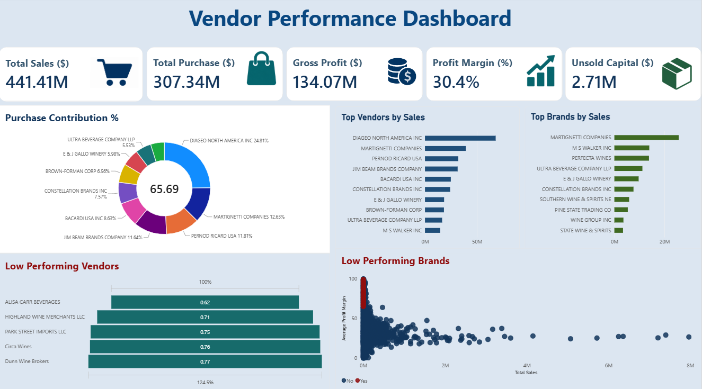

# 📊 Vendor Performance Analysis

## 📌 Project Overview

Vendor Performance Analysis is an end-to-end data analytics project designed to evaluate vendor sales, purchasing, profitability, inventory, and brand performance.

The project combines **SQL, Python, and Power BI** to transform raw vendor data into meaningful business insights and an interactive dashboard.

The analysis helps identify high-performing vendors, low-performing vendors and brands, profitability patterns, and unsold inventory capital.

---

## 🎯 Business Objectives

- Analyze vendor sales and purchase performance
- Identify top-performing vendors and brands
- Identify low-performing vendors and brands
- Evaluate gross profit and profit margins
- Analyze purchase contribution by vendors
- Identify capital tied up in unsold inventory
- Provide actionable insights through an interactive Power BI dashboard

---

## 🛠️ Tools & Technologies

| Category | Technology |
|---|---|
| Programming | Python |
| Data Analysis | Pandas, NumPy |
| Data Visualization | Matplotlib, Seaborn |
| Database | SQLite |
| Query Language | SQL |
| Business Intelligence | Power BI |
| Development Environment | Jupyter Notebook |
| Version Control | Git & GitHub |

---

## 🔄 Project Workflow

```text
Raw Vendor Data
       ↓
SQLite Database
       ↓
SQL Exploratory Data Analysis
       ↓
Python Data Analysis
       ↓
Vendor Sales Summary
       ↓
Power BI Dashboard
       ↓
Business Insights

```
---

## 📂 Project Structure

```
Vendor-Performance-Analysis/
│
├── data/
│   └── vendor_sales_summary.csv
│
├── notebooks/
│   ├── 01_SQL_Exploratory_Data_Analysis.ipynb
│   └── 02_Python_Vendor_Performance_Analysis.ipynb
│
├── powerbi/
│   └── Vendor_performance_dashboard.pbix
│
├── screenshots/
│   └── VendorPerformanceSC.png
│
├── scripts/
│   ├── get_vendor_summary.py
│   └── ingestion_db.py
│
└── README.md

```
--- 

## 🔍 Key Business Questions & Answers

### 1. Which vendors generate the highest sales?

The **Top Vendors by Sales** analysis identifies the vendors contributing the highest sales revenue. This helps the business understand which vendors are major contributors to overall sales performance.

### 2. Which brands contribute the most to overall sales?

The **Top Brands by Sales** analysis identifies the brands generating the highest sales. This provides visibility into which brands are driving overall revenue.

### 3. Which vendors have relatively low sales performance?

The **Low Performing Vendors** analysis highlights vendors with comparatively lower sales performance. These vendors can be investigated further using sales, purchase, profitability, and inventory metrics.

### 4. Which brands have relatively low sales performance?

The **Low Performing Brands** analysis identifies brands with comparatively lower sales contribution and helps highlight areas requiring further investigation.

### 5. What percentage of purchasing comes from each vendor?

The **Purchase Contribution %** analysis measures each vendor's contribution to total purchasing value. This helps identify vendors that account for a significant share of procurement activity.

### 6. What is the overall gross profit?

The dashboard reports approximately **134.07M in Gross Profit**, calculated from the difference between total sales and total purchase value.

### 7. What is the overall profit margin?

The overall profit margin is approximately **30.4%**, providing a high-level view of profitability across the analyzed vendor portfolio.

### 8. How much capital is tied up in unsold inventory?

Approximately **2.71M** of capital is associated with unsold inventory. This highlights the importance of monitoring slow-moving and unsold stock.

### 9. What are the overall sales and purchasing values?

The analysis reports approximately:

- **Total Sales:** 441.41M
- **Total Purchase:** 307.34M
- **Gross Profit:** 134.07M
- **Profit Margin:** 30.4%
- **Unsold Capital:** 2.71M

### 10. Which vendors require further investigation?

Vendors with relatively low sales performance, high purchase contribution but weaker sales outcomes, or potential inventory-related issues can be investigated further using the dashboard.

---

## 📊 Power BI Dashboard

The Power BI dashboard provides an interactive view of vendor performance.

Key Performance Indicators
| KPI | Value |
|---|---:|
| Total Sales | 441.41M |
| Total Purchase | 307.34M |
| Gross Profit | 134.07M |
| Profit Margin | 30.4% |
| Unsold Capital | 2.71M |

Dashboard Analysis

The dashboard includes:

Purchase Contribution %
Top Vendors by Sales
Top Brands by Sales
Low Performing Vendors
Low Performing Brands
Key financial performance indicators

---

## 💡 Key Insights

### Financial Performance

- Total Sales reached approximately **441.41M**.
- Total Purchase value was approximately **307.34M**.
- Gross Profit was approximately **134.07M**.
- Overall Profit Margin was approximately **30.4%**.
- Approximately **2.71M** of capital is tied up in unsold inventory.

### Vendor Performance

- Vendor performance varies significantly across the portfolio.
- The Top Vendors analysis identifies the vendors contributing the highest sales.
- Low-performing vendors can be investigated to understand potential sales, purchasing, or inventory issues.
- Purchase Contribution % highlights the vendors responsible for a significant share of procurement activity.

### Brand Performance

- Sales contribution differs across brands.
- Top Brands by Sales identifies the brands contributing the highest revenue.
- Low-performing brands can be investigated further for sales and inventory optimization opportunities.

### Inventory Performance

- Unsold inventory represents capital that is currently not generating sales.
- The dashboard tracks unsold capital to provide visibility into inventory efficiency.
- Further inventory turnover and aging analysis could provide deeper insights into slow-moving products.

### Business Interpretation

The analysis demonstrates that vendor performance should not be evaluated using sales alone. Combining sales, purchases, profitability, brand performance, and unsold inventory provides a more complete view of vendor performance.

---

## 🧮 Analysis Performed

SQL Analysis

The SQL analysis focuses on:

Data exploration
Vendor-level aggregation
Sales and purchase analysis
Profitability analysis
Vendor performance comparison
Identification of performance trends
Python Analysis

Python was used for:

Data preparation
Data transformation
Exploratory analysis
Vendor performance calculations
Aggregation of sales and purchase metrics
Generation of summary data for Power BI
Power BI Analysis

Power BI was used to create an interactive dashboard containing:

KPI cards
Donut chart
Bar charts
Scatter plot
Vendor and brand performance analysis

---

## 📈 Dashboard Preview

The Power BI dashboard provides an interactive view of vendor sales, purchasing, profitability, brand performance, and unsold inventory.



---

## 💼 Business Value

The analysis can support organizations in:

- Monitoring vendor sales performance
- Identifying major sales-contributing vendors
- Evaluating purchasing concentration
- Monitoring profitability
- Identifying low-performing vendors
- Identifying low-performing brands
- Monitoring capital tied up in unsold inventory
- Supporting vendor management decisions
- Supporting inventory optimization
- Improving data-driven procurement decisions
- Providing management with an interactive performance dashboard

The project demonstrates how raw operational data can be transformed into business-ready insights using SQL, Python, and Power BI.

--- 

## 🎯 Project Outcome

The project successfully transforms raw vendor and sales data into an end-to-end analytical solution.

The final solution provides:

- SQL-based exploratory analysis
- Python-based data cleaning and transformation
- Vendor and brand performance analysis
- Financial KPI calculations
- Purchase contribution analysis
- Unsold inventory analysis
- Interactive Power BI dashboard
- Business-focused insights
- A structured analytics workflow suitable for portfolio demonstration

---

## 🚀 Future Improvements

The project can be further enhanced by:

Adding monthly and yearly vendor performance trends
Adding vendor profitability analysis
Adding vendor segmentation
Adding inventory turnover analysis
Adding ABC/Pareto analysis
Adding vendor-level drill-through pages
Adding detailed vendor profiles
Adding sales forecasting
Adding inventory demand forecasting
Adding automated Power BI data refresh
Adding additional supply-chain KPIs
Adding interactive what-if analysis
Adding automated alerts for important performance changes


Interested in:

Data Analytics
Business Intelligence
Data Science
Machine Learning
Data Visualization

---
## 👩‍💻 Author

### Mamta Chaudhary

🎓 **BSc Data Science & Artificial Intelligence**

📧 **Email:** 
choudharymamta1003@gmail.com

🔗 **LinkedIn:** https://www.linkedin.com/in/mamta-chaudhary-964128353/

🔗 **GitHub:** 
---

⭐ If you find this project interesting, consider giving the repository a star!

